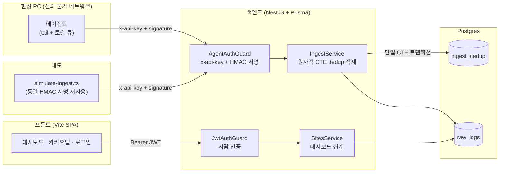

# SiteScope — 건설현장 계측 데이터 수집 플랫폼

건설현장 PC에서 도는 에이전트가 계측 센서 로그(경사계·진동·지하수위·균열폭 등)를 tail 하여
**HMAC-SHA256 서명 + API 키**로 인증한 뒤 수집 API로 전송·적재하고, 담당자는 **웹 대시보드**에서
현장별 수신 현황·계측 추이·경보·지도 위치를 모니터링하는 IoT형 데이터 수집 플랫폼이다.

핵심은 신뢰할 수 없는 네트워크 너머의 에이전트가 보내는 데이터를 **위·변조 없이(HMAC), 정확히
한 번만(멱등성) 적재**하는 수집 파이프라인이다.

## 핵심 기능

- **서명 검증 수집 API** — `POST /api/ingest`. `x-api-key` + HMAC-SHA256 서명(`timingSafeEqual`
  상수시간 비교) 검증 후 적재.
- **원자적 멱등 적재** — 애플리케이션 락이 아니라 Postgres 단일 CTE 쿼리
  (`INSERT ... ON CONFLICT DO NOTHING` + 조건부 본삽입)로 동시 중복 요청의 race condition을
  DB 레벨에서 원천 차단. 같은 요청을 몇 번 재전송해도 안전(`{status:'duplicate'}`).
- **두 종류의 인증 경계 공존** — 기계(에이전트)는 API 키+HMAC 무상태 인증, 사람(담당자)은
  Passport-JWT 로그인. 한 서버 안에서 Guard로 명확히 분리.
- **현장 대시보드** — KPI 카드, 계측 추이 차트, 최근 경보, 실시간에 가까운 로그 스트림
  (TanStack Query polling). 카카오맵으로 현장 위치 시각화.
- **가짜 시드가 아닌 진짜 파이프라인 데이터** — 데모 데이터를 DB에 직접 INSERT 하지 않고,
  실제 HMAC 서명 로직을 재사용하는 시뮬레이션 스크립트가 정상 `POST /api/ingest`를 거쳐 만든다.

## 아키텍처



두 인증 경계: **왼쪽(기계)** 은 API 키 + HMAC 서명(무상태), **오른쪽(사람)** 은 로그인 후 발급되는
JWT(상태 기반). `POST /api/ingest`·`GET /api/ingest/stats`는 `AgentAuthGuard`, `/api/sites/*`는
`JwtAuthGuard`가 각각 보호한다. 자세한 시퀀스는 [`ARCHITECTURE.md`](./ARCHITECTURE.md) 참고.

## 스택

- **백엔드**: NestJS + Prisma + Postgres(로컬 docker-compose / 배포 Neon)
- **프론트**: Vite + React + TypeScript + Tailwind v4 + Zustand + TanStack Query + 카카오맵
- **인증**: Passport-JWT(사람) / HMAC-SHA256(기계)
- **테스트**: Jest + supertest(단위/통합) + Testcontainers(Postgres 동시성 증명)

## 로컬 실행

### 1) Docker Compose로 한 번에 띄우기 (권장)

```bash
docker compose up --build -d
```

Postgres + 백엔드가 함께 뜨고(컨테이너 시작 시 `prisma migrate deploy` 자동 실행), `http://localhost:3000/api/health`가 `{ ok: true }`를 반환하면 준비된 것이다.

```bash
docker compose exec backend npm run seed:demo
```

데모 admin 계정 → 현장 4곳 → HMAC 서명 시뮬레이션 이력(경보 포함) 순서로 채워진다.

### 2) 개별 실행 (개발 중 hot-reload가 필요할 때)

```bash
# backend
cd backend
cp .env.example .env   # DATABASE_URL 등 값 채우기
npm install
npm run prisma:migrate
npm run start:dev

# 다른 터미널에서 데모 데이터 시드(서버가 떠 있어야 함 — 시뮬레이터가 실제 HTTP로 보낸다)
npm run seed:demo

# frontend
cd frontend
cp .env.example .env.local
npm install
npm run dev
```

`npm run seed:demo`는 `seed:admin`(admin/admin) → `seed:sites`(현장 4곳) →
`seed:simulate`(HMAC 서명 시뮬레이션, 경보·중복 케이스 포함)를 순서대로 실행한다. `seed:simulate`는
결정적 시드로 데이터를 생성하므로 **재실행해도 멱등**(전부 `duplicate` 응답, `raw_logs` 증가 없음).

### 데모 로그인

프론트 로그인 화면의 "데모 계정으로 로그인" 버튼을 누르거나, `admin` / `admin`으로 직접 로그인한다.

## API 문서

서버 실행 후 `GET /api/docs` (Swagger UI). 인증 경계별 엔드포인트 목록은 [`API.md`](./API.md)에도
정리돼 있다.

## 테스트

```bash
cd backend
npm test        # 단위 테스트(HMAC 서명, dedup 분기, alert 임계값, JWT 전략, DTO 검증)
npm run test:e2e   # 통합 테스트 — 실제 Postgres(Testcontainers)로 dedup CTE의 "정확히 1건만 적재"
                    # 동시성을 증명하고, 회원가입→로그인→현장조회 흐름도 검증한다.
```

`test:e2e`는 로컬 `.env`의 `DATABASE_URL`(기존 dev DB)을 쓰는 스펙과, Testcontainers가 매번 새로
띄우는 임시 Postgres를 쓰는 동시성 스펙이 함께 실행된다. 후자는 Docker가 필요하다.

## 카카오맵 키 발급

지도 위젯은 카카오 JS SDK를 쓴다. [Kakao Developers](https://developers.kakao.com/)에서 애플리케이션을
등록하고 **JavaScript 키**를 발급받아 `frontend/.env`의 `VITE_KAKAO_MAP_APP_KEY`에 넣는다(플랫폼
설정에 로컬/배포 도메인을 등록해야 함). 키가 비어 있으면 지도 대신 안내 플레이스홀더가 표시된다.

## 폴더 구조

```
backend/    NestJS API (ingest / auth / sites / health)
frontend/   Vite SPA 대시보드
agent/      Windows 수집 에이전트(참조용, 이번 재작업 범위 아님)
```

## 스코프 아웃

- 모바일 네이티브 앱 없음(반응형 웹으로 모바일 대응).
- 실제 GPS/센서 하드웨어 연동 없음 — `simulate-ingest.ts`가 실제 서명 파이프라인으로 대체.
- WebSocket 실시간 push 없음 — TanStack Query polling으로 준실시간 처리.
- 복잡한 다중 역할 RBAC 없음 — 로그인 사용자면 전 현장 조회 가능한 단순 인증.
- 에이전트 실행파일(exe) 재배포 없음 — 소스는 참조용으로 유지.

## 설계 문서

[`SPEC.md`](./SPEC.md) · [`ARCHITECTURE.md`](./ARCHITECTURE.md) · [`DATA-MODEL.md`](./DATA-MODEL.md) ·
[`API.md`](./API.md) · [`PLAN.md`](./PLAN.md) · [`DESIGN.md`](./DESIGN.md)
